# cloud assignment

##### Your login name: altschool i.e., home directory /home/altschool. The home directory contains the following sub-directories: code, tests, personal, misc Unless otherwise specified, you are running commands from the home directory.

1. `create directory`

2. `Change directory to the tests directory using absolute pathname` 

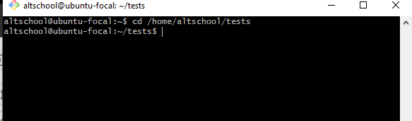

3. `Change directory to the tests directory using relative pathname`

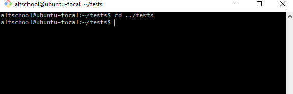

4. `Use echo command to create a file named fileA with text content ‘Hello A’ in the misc directory`

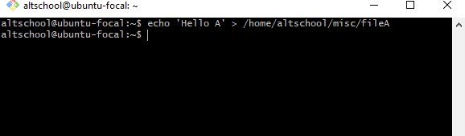

5. ` Create an empty file named fileB in the misc directory. Populate the file with dummy content afterwards`

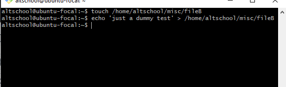

6. `Copy contents of fileA into fileC`

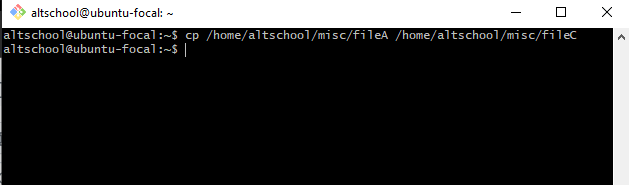

7. `Move contents of fileB into fileD`

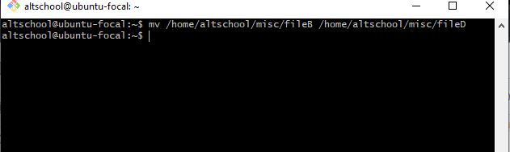

8. `Create a tar archive called misc.tar for the contents of misc directory`

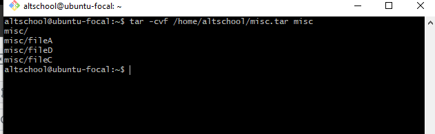

9. `Compress the tar archive to create a misc.tar.gz file`

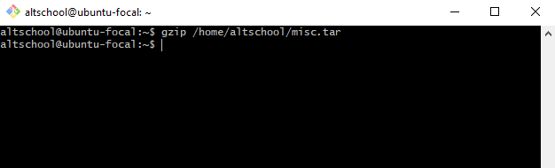

10. ` Create a user and force the user to change his/her password upon login`

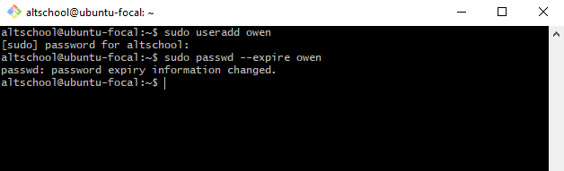

11. `Lock a user's password: a user was first created and then i proceeded to lock the password`

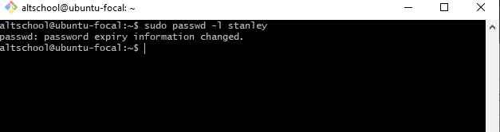

12. `Create a user with no login shell`

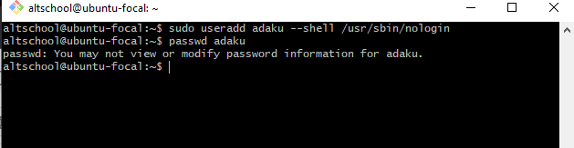

13. ` Disable password-based authentication for ssh: this was achieved using the command sudo vim /etc/ssh/sshd_config`

14. ` Disable root login for ssh: using same as above in no 13`

